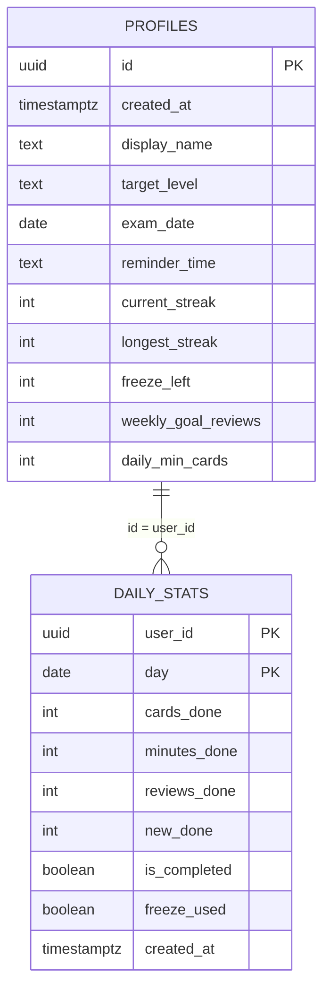
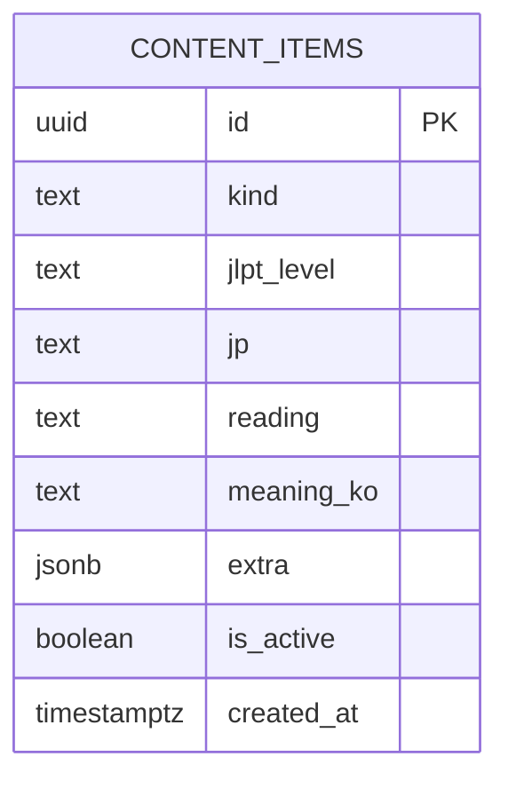
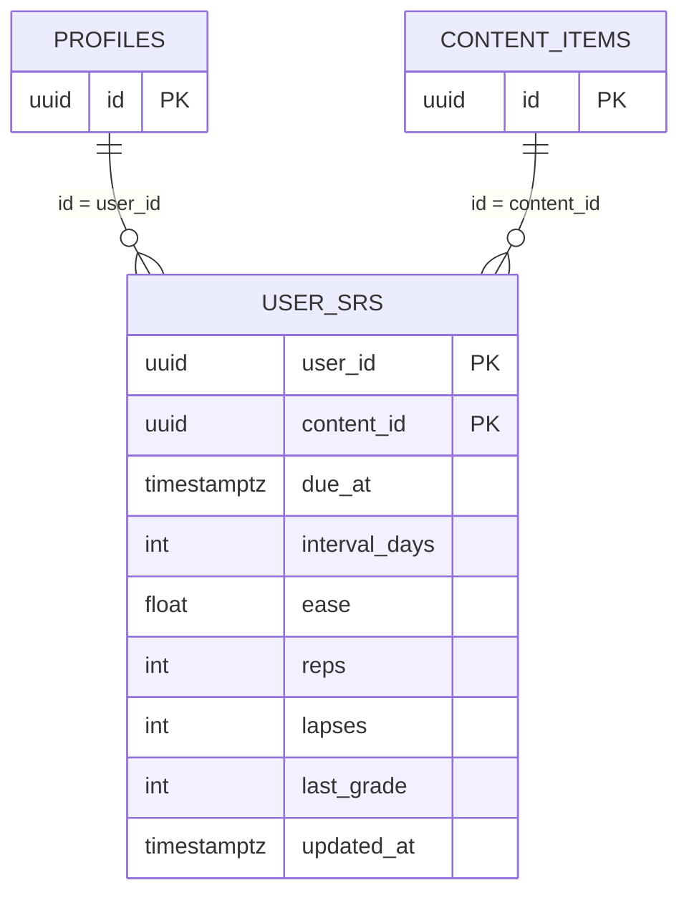
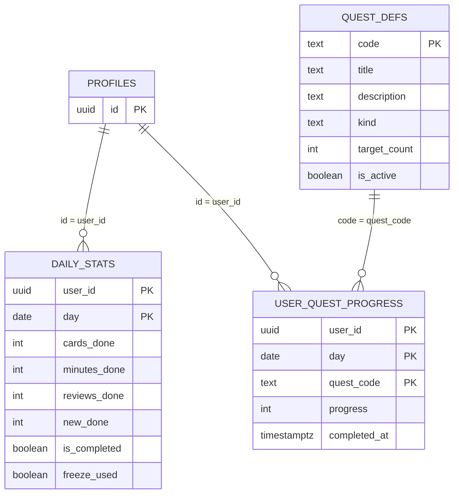
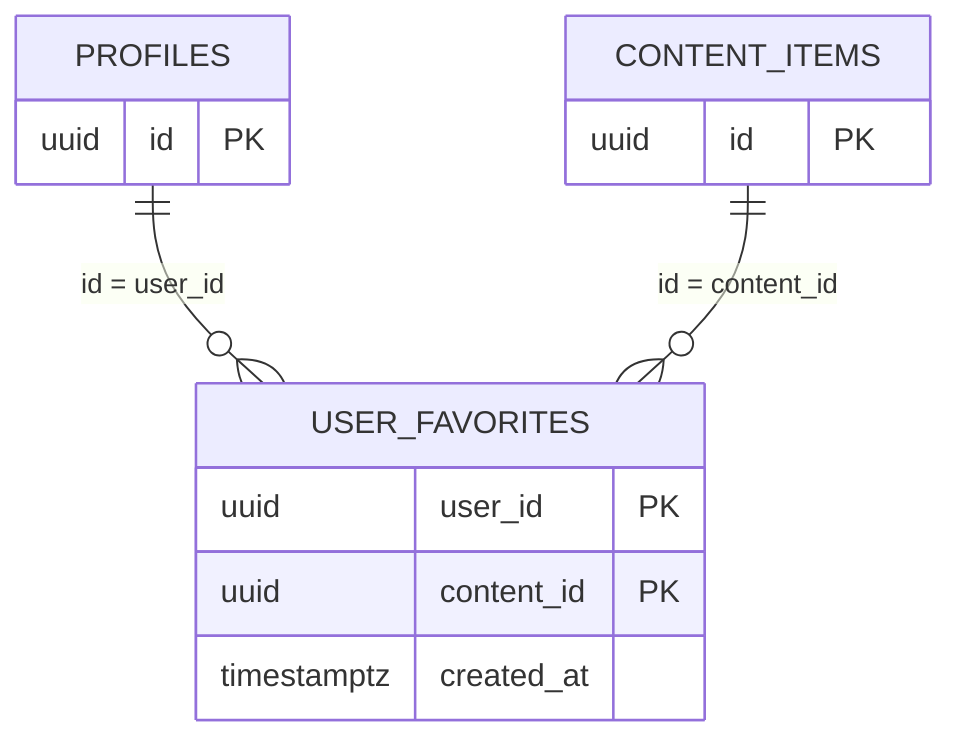

# PRD - 일어톡톡 (Flutter Cross-Platform · Supabase · Modular)

## 0. 문서 메타
- 제품명: 일어톡톡
- 플랫폼: iOS / Android (Flutter)
- 최소 지원 버전:
  - iOS 18.0+
  - Android 15+ (API 35+)
- 백엔드: Supabase (Auth + Postgres + RLS)
- 목표: JLPT 특화 일본어 학습 앱 (자동 복습 + 최소 완료 + 위젯 재방문)

## 1. 문제 정의
- 학습자가 매일 무엇을 해야 하는지 불명확해 루틴이 쉽게 끊긴다.
- 단어/문자 암기가 복습 루프(SRS, 약점 보완, 진척 확인)로 연결되지 않는다.
- 앱이 오늘 학습량을 자동 제시하고 최소 완료 구조로 습관을 유지시킨다.

## 2. 목표 / 비목표

### 2.1 MVP 목표
1. SRS 기반 자동 복습 (due 큐 생성/갱신)
2. 히라가나/가타카나 + JLPT N5 단어 학습
3. 오늘 플랜: 최소 완료(3카드) / 10분 / 20분
4. 동기부여: streak + freeze + 진척 가시화 + 데일리 퀘스트(1개)
5. 홈스크린 위젯(iOS/Android): 오늘 복습 / 오늘의 단어

### 2.2 비목표
- 기출 기반 모의고사
- 고정밀 발음 채점(ASR 스코어링)
- 대규모 커뮤니티
- 관리자 CMS(초기 제외)

## 3. 타겟 사용자
- P1: N5~N4 입문자(하루 10~20분)
- P2: 재도전자(복습 루틴 중심)
- P3: 바쁜 직장인(최소 완료 필요)

## 4. 핵심 사용자 여정

### 4.1 첫 사용
1. 온보딩 → 로그인
2. 목표 레벨/시험일 설정
3. 최소 완료(3카드) 또는 10분 플랜 시작
4. 완료 화면에서 streak/진척 확인
5. 위젯 추가 유도

### 4.2 매일 루틴
1. 위젯에서 오늘 복습 수량 확인
2. 탭 후 즉시 복습 시작
3. Again/Good 평가
4. 오늘 완료 처리 및 내일 due 준비

## 5. 기능 요구사항(MVP)

### 5.1 인증/프로필
- Supabase Auth 연동
- 로그인: Apple, Google, 이메일(선택)
- 프로필: 목표 레벨, 시험일, 알림 시간, 주간 목표

수용 기준:
- 모든 사용자 데이터 RLS 격리
- 재로그인 시 진도 복원

### 5.2 콘텐츠
- kind: `kana`, `vocab` (확장: `sentence`, `grammar`)
- Kana 표/카드 학습
- N5 단어 목록/검색/상세/카드 학습

수용 기준:
- 콘텐츠는 read-only
- N5 단어 시드 제공

### 5.3 SRS
- 평가 버튼: Again / Good
- Again: interval=1, lapses+1
- Good: interval=max(2, round(interval*2))
- due 기준: `due_at <= now()`

수용 기준:
- dueCount 계산 가능
- 평가 저장 즉시 dueCount 갱신

### 5.4 오늘 플랜
- 표시: 복습 남은 개수, 신규 추천, 예상 시간
- 버튼: 최소 완료(3카드) / 10분 / 20분

수용 기준:
- 3카드 완료 시 오늘 완료 처리
- 완료 화면 간결 요약 + CTA

### 5.5 동기부여
- streak
- freeze(주 1회 지급 정책)
- 진척: Kana 완료율, N5 마스터리, 주간 목표
- 데일리 퀘스트 1개

수용 기준:
- 죄책감 유발 카피 금지
- 최소 완료가 루틴 안전장치로 동작

### 5.6 위젯(iOS 18+, Android 15+)
- DueCountWidget: `복습 N개 · 약 M분`
- DailyWordWidget: 오늘의 단어 1개
- 딥링크:
  - `studyjlpt://review`
  - `studyjlpt://content/<uuid>`

수용 기준:
- 위젯 탭 시 즉시 해당 화면 진입
- 오프라인 캐시 표시 가능

## 6. 기술/아키텍처 요구사항

### 6.1 모듈러 구조
- Core/Shared, Feature, Data 모듈 분리
- 모듈 단위 테스트/배포/확장 가능 구조

### 6.2 권장 패키지
- `core`, `design_system`, `supabase_gateway`
- `auth_feature`, `profile_feature`, `content_feature`
- `study_feature`, `motivation_feature`, `widgets_bridge`, `notifications_feature`

### 6.3 플랫폼 제약
- iOS 18+ 전용 빌드/테스트
- Android API 35+ 전용 빌드/테스트
- CI에서 최소 SDK 기준 빌드 검증 필수

## 7. DB 모듈 소유권
- identity/profile: `profiles`
- content: `content_items`
- study/srs: `user_srs`
- motivation: `daily_stats`, `quest_defs`, `user_quest_progress`
- favorites: `user_favorites`
- widgets_bridge: DB 미소유(캐시 전용)

## 8. 데이터/RLS 요구사항
- 사용자 데이터 테이블 RLS 필수
- 기본 정책: `auth.uid() = user_id`
- 콘텐츠 테이블은 공개 읽기 정책 + 관리자 쓰기 제한

## 9. 핵심 테이블
- `profiles`
- `content_items`
- `user_srs`
- `daily_stats`
- `user_favorites`
- `quest_defs`
- `user_quest_progress`

## 10. 모듈 간 UseCase 계약
- Today:
  - `GetTodaySummary()`
  - `StartPlan(mode)`
  - `CompleteSession(result)`
- Study:
  - `GetDueQueue(limit)`
  - `GetNewQueue(limit, level)`
  - `GradeCard(contentId, grade)`
- Content:
  - `SearchContent(kind, query, level?)`
  - `GetContentDetail(id)`

## 11. 분석 이벤트
- `onboarding_completed`
- `login_success`
- `daily_plan_started(mode)`
- `card_answered(kind, grade, duration_ms)`
- `study_completed(cards, minutes)`
- `widget_opened(type)`

## 12. 릴리즈 기준(MVP)
- 로그인 → 오늘 플랜 → 10카드 완료 3분 내 가능
- SRS due 생성/갱신 정상
- 최소 완료(3카드)로 오늘 완료 가능
- streak/freeze가 Asia/Seoul 기준 동작
- 위젯 2종 캐시 표시 + 딥링크 진입 성공
- RLS 격리 검증 통과
- iOS 18 디바이스/시뮬레이터 검증 통과
- Android 15(API 35) 디바이스/에뮬레이터 검증 통과

---

## 모듈별 ERD (Mermaid)

### 1) Identity/Profile

### 2) Content

### 3) Study/SRS

### 4) Motivation

### 5) Favorites

