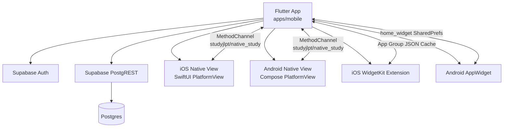
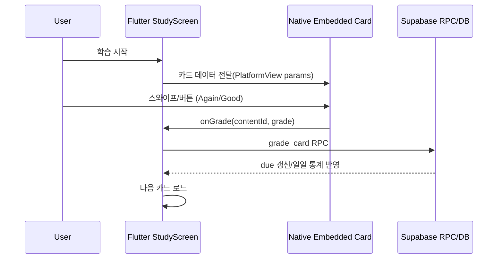
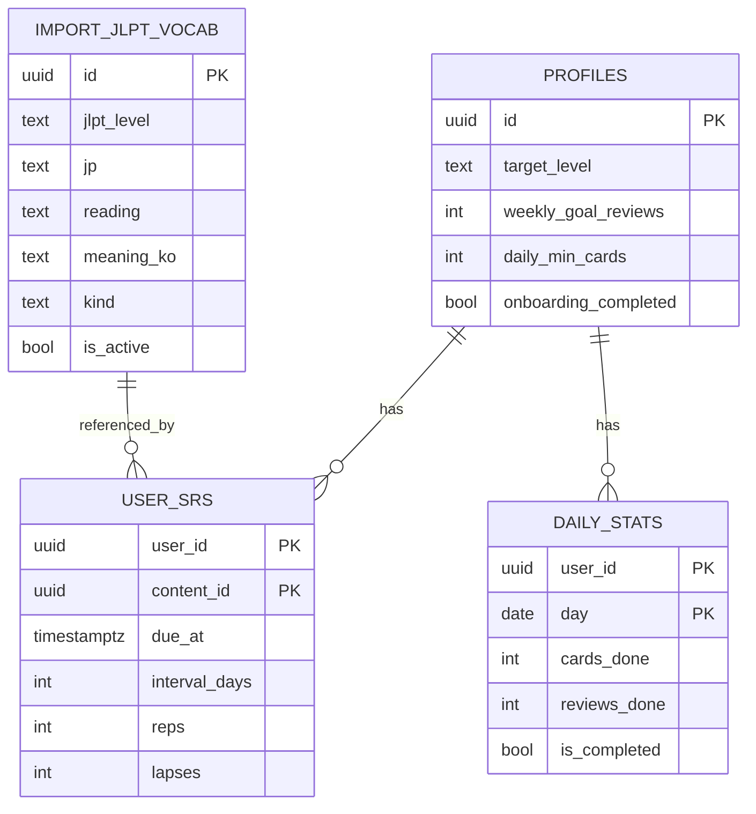

# study-jlpt

일어톡톡(Study JLPT) MVP 저장소입니다.  
Flutter(iOS/Android) 클라이언트와 Supabase(Postgres/Auth/RLS) 기반 학습 백엔드를 포함합니다.

## 프로젝트 개요
- 목표: JLPT 학습 루틴 앱(MVP)
- 클라이언트: Flutter (`apps/mobile`)
- 백엔드: Supabase SQL 마이그레이션/시드 (`supabase`)
- 데이터 파이프라인: JLPT CSV -> 한국어 의미 변환/적재 (`scripts`)

## 핵심 기능
- OAuth 로그인(Apple/Google + Supabase Auth)
- 온보딩 1회 설정(목표 레벨/주간 목표/최소 완료)
- 오늘 플랜/진척 요약
- 학습 세션(SRS Again/Good)
- 네이티브 임베드 학습 카드
  - iOS: SwiftUI PlatformView
  - Android: Compose PlatformView
- 홈 위젯 2종
  - DueCountWidget(오늘 복습 수)
  - DailyWordWidget(오늘의 단어)
- 로컬 알림 스케줄링
  - 프로필의 알림 시간(`HH:mm`) 기준 일일 알림 예약
- 콘텐츠 조회/검색
- 프로필 설정 변경

## 저장소 구조
```text
apps/mobile/                 Flutter 앱
  lib/
    features/                auth, onboarding, today, study, content, profile
    data/                    repositories, supabase adapters
    shared/                  app state, 공통 위젯
  ios/                       iOS 네이티브 임베드 카드 구현
  android/                   Android 네이티브 임베드 카드 구현

supabase/
  migrations/                DB 스키마/정책 변경 SQL
  import_ready/              import용 CSV 산출물
  seed/                      초기 데이터
  tests/                     RLS/검증 SQL

scripts/
  convert_jlpt_csv.py
  convert_jlpt_csv_to_korean.py
```

## 아키텍처 UML
### 1) 컴포넌트 다이어그램


### 2) 학습 시퀀스 다이어그램


### 3) 데이터 모델(요약)


## 로컬 실행
### 1) 앱 실행
```bash
cd apps/mobile
flutter pub get
flutter run
```

### 2) iOS 실행(권장)
```bash
cd apps/mobile
flutter clean
cd ios && pod install && cd ..
flutter run -d "iPhone 17 Pro"
```

## Supabase 연결
`apps/mobile/lib/core/config/supabase_local_config.dart`에 값을 넣으면 매번 `--dart-define` 없이 실행할 수 있습니다.

필수 값:
- `url`: Supabase Project URL
- `publishableKey`: Supabase Publishable Key

## Supabase SQL 적용 순서
현재 저장소 기준 필수 마이그레이션:
1. `supabase/migrations/20260215170000_add_onboarding_completed.sql`
2. `supabase/migrations/20260215234500_use_import_vocab_directly.sql`
3. `supabase/migrations/20260216162000_server_aggregation_sync.sql`
4. `supabase/migrations/20260216173000_fix_today_summary_ambiguous_cards_done.sql`

실행 위치:
- Supabase Dashboard -> SQL Editor

## 데이터 적재
영문 뜻 CSV를 한국어 뜻으로 변환해 import 파일 생성:
```bash
python3 scripts/convert_jlpt_csv_to_korean.py \
  supabase/import_ready/jlpt_vocab_ko.csv \
  ~/Downloads/n1.csv ~/Downloads/n2.csv ~/Downloads/n3.csv ~/Downloads/n4.csv ~/Downloads/n5.csv
```

생성 파일(`supabase/import_ready/jlpt_vocab_ko.csv`)을 `import_jlpt_vocab`에 업로드해서 사용합니다.

## 현재 설정 메모
- Bundle/Application ID: `co.gaeng2y.studyjlpt`
- OAuth 딥링크 스킴: `studyjlpt://login-callback/`
- 네이티브 학습 채널: `studyjlpt/native_study`
- 위젯 App Group: `group.co.gaeng2y.studyjlpt`
- 위젯 업데이트 키:
  - `today_summary_json`
  - `today_word_json`

## 위젯/딥링크 동작
- iOS:
  - WidgetKit 타깃: `StudyWidgets`
  - 위젯 탭 딥링크:
    - `studyjlpt://review`
    - `studyjlpt://content/today-word`
- Android:
  - AppWidget Provider:
    - `DueCountWidgetProvider`
    - `DailyWordWidgetProvider`
  - 위젯 탭 딥링크 host:
    - `review`
    - `content`

## 참고
- 이 저장소는 MVP 개발 중이라, 일부 문서/스크립트는 계속 갱신될 수 있습니다.
- `README.md` 기준 흐름과 다를 경우 최신 커밋 로그를 우선 확인하세요.
